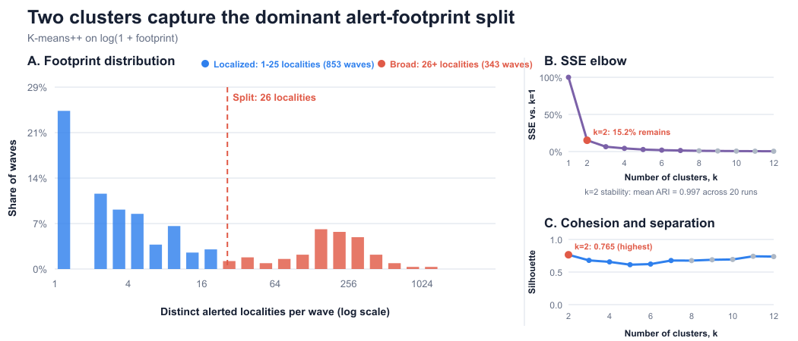
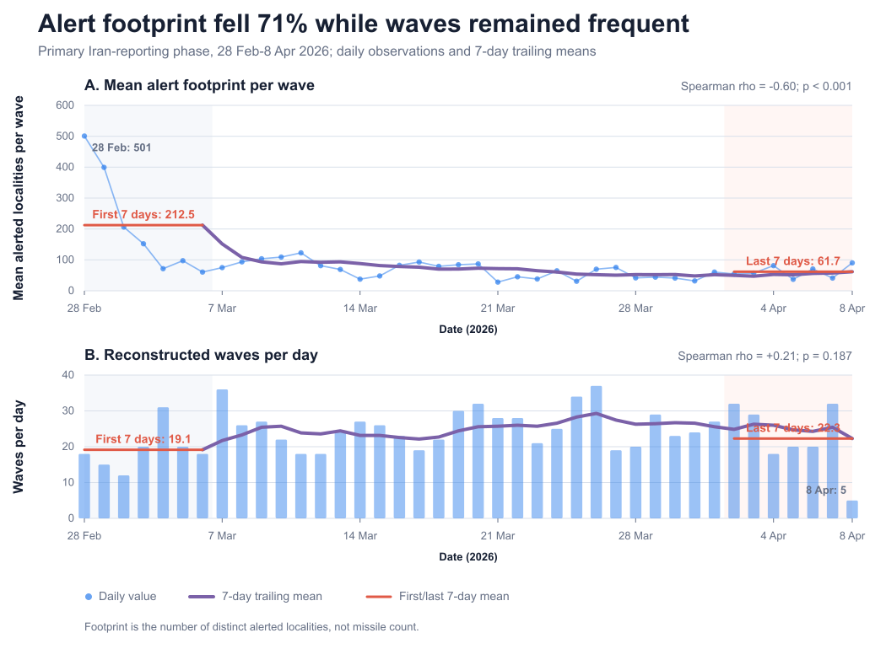
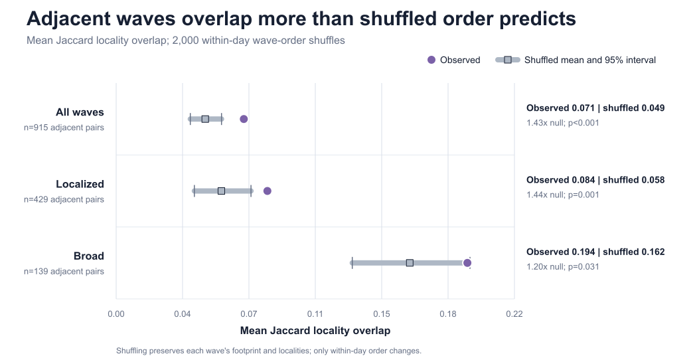

# Alert-wave dynamics

This module investigates one connected question:

> How did the spatial footprint and short-term targeting structure of missile-alert waves evolve during the second war?

The analysis finds two descriptive wave families, a strong contraction in alert footprint during the primary 40-day Iran-reporting phase, and more locality overlap between consecutive waves than expected after shuffling their within-day order.

An alert row is an **alerted locality**, not a missile. The results describe warning footprints and their timing; they do not measure launch counts, ammunition, damage, or attacker intent.

## Reproduce everything

From the repository root, create an environment and install the Python dependencies once:

```bash
python3 -m venv .venv
.venv/bin/pip install -r requirements.txt
```

Then run:

```bash
.venv/bin/python alert_waves_analysis/run_all.py --test
```

By default, this uses the saved official-message snapshot, rebuilds source labels, regenerates every table and figure, and runs both test suites. Pass `--online` only when an intentional source refresh is required.

## Method

1. Keep direct missile alerts (`category == 1`).
2. Remove exact duplicate locality/timestamp pairs: 37 in the second-war data.
3. Combine consecutive alerts when the gap is at most 8 minutes.
4. Measure a wave's footprint as its number of distinct alerted localities.
5. Treat the heavy-tailed footprint distribution as an unsupervised descriptive task and fit K-means++ to `log(1 + footprint)`.
6. Perform relative validation over `k = 1,...,12` using SSE/elbow behavior, silhouette score,
   and assignment stability. To keep the result interpretable as wave families, require every
   candidate cluster to contain at least 5% of waves; among the eligible solutions (`k = 2,...,7`),
   this selects two clusters and a 26-locality boundary.
7. Define the primary phase independently from footprint: 2026-02-28 through 2026-04-08 is the longest continuous run of days with eligible official Iran incoming-threat reports.
8. Use days as the statistical units for footprint trends.
9. Test short-term target persistence against a randomization-based null distribution from 2,000 within-day order shuffles. Every shuffle preserves each wave's footprint, family, and localities.

## Main findings

### 1. Alert waves have two distinct footprint scales

Across the full second-war dataset, relative validation evaluates `k = 1,...,12`. Solutions
through `k = 7` satisfy the 5% minimum-cluster criterion. Among these, `k = 2` gives the largest
SSE elbow improvement (84.8% below `k = 1`), the highest silhouette score (0.765), and stable assignments
across 20 single-start K-means++ fits (mean pairwise adjusted Rand index = 0.997). The final
50-restart fit contains 853 localized and 343 broad waves, with geometric centers near 3 and
171 alerted localities. These are descriptive data families, not official military categories.



### 2. Footprint contracted while wave cadence remained high

During the 40-day primary phase, daily mean wave footprint declines with day (Spearman rho = -0.60, p = 0.000043). Comparing the first and last seven days:

- Mean footprint falls from 212.5 to 61.7 localities per wave, a 71% reduction.
- Mean cadence rises from 19.1 to 22.3 waves per day.
- Mean daily broad-wave share falls from 56.7% to 34.0%.
- The median footprint among broad waves also declines (rho = -0.50, p = 0.0011).

The final point matters: the contraction is not explained only by replacing broad waves with localized waves. The remaining broad waves also become smaller.
Daily wave count has no downward monotonic trend (rho = +0.21, p = 0.19), so the
cadence statement is descriptive and does not claim statistical equivalence.



The separate `second_war_evolution` figure is retained as a supporting diagnostic for the
family-composition and within-broad-wave trends; it is not required for the main three-figure story.

### 3. Consecutive waves show modest short-term target persistence

The mean Jaccard locality similarity between all adjacent waves is 0.071, compared with 0.049
under the shuffled null model. The absolute effect size is modest (0.021), but the observed
sequence has 1.43 times the null similarity (permutation p < 0.001).

- Localized-localized adjacent pairs: 1.44 times the shuffled overlap (p = 0.0015).
- Broad-broad adjacent pairs: 1.20 times the shuffled overlap (p = 0.031).

Overall and localized-wave persistence survive every tested wave-gap definition. Broad-wave persistence is weaker and is not significant with a 15-minute gap, so it should be presented cautiously.



## Robustness and reality checks

- With wave gaps of 3, 5, 8, 10, and 15 minutes, the footprint trend remains negative (rho from -0.54 to -0.63) and the early-to-late reduction remains 69.6%-71.8%.
- After excluding the unusually broad first seven days, the footprint trend remains negative and significant (rho = -0.44, p = 0.011).
- Moving the primary phase endpoint by -7, -3, +3, or +7 days does not reverse the footprint result.
- The reconstruction audit includes the largest, longest, and closest-to-cutoff waves in `outputs/tables/wave_reality_checks.csv`. Some waves last up to 42 minutes because several sub-eight-minute gaps chain together; the gap sensitivity test addresses this risk.
- Source labels are contextual evidence only. The combined accepted Iran-labeled subset declines, but the high-confidence subset alone does not (rho = -0.13, p = 0.44). This contradiction is retained in `outputs/tables/source_trend_diagnostics.csv` and prevents treating source labels as independent confirmation of the temporal trend.

## Limitations

- Locality count is neither physical area nor population exposed.
- A temporal gap rule can merge distinct launches or split one prolonged event.
- The official-report phase definition depends on the completeness and parser accuracy of the saved IDF message snapshot.
- Source labels cover only 28.8% of waves and official posts are not a random sample.
- P-values evaluate specific null models; they do not establish a tactical cause.
- Cross-war comparisons are secondary because the first-war dataset contains only 41 reconstructed waves and may reflect different recording policy.

## Important outputs

- `outputs/figures/wave_size_distribution.svg` - footprint-family figure
- `outputs/figures/primary_phase_summary.svg` - headline footprint/cadence figure
- `outputs/figures/target_persistence.svg` - adjacency-baseline figure
- `outputs/tables/key_findings.csv` - compact main results
- `outputs/tables/cluster_validation.csv` - relative K-means validation and initialization stability
- `outputs/tables/wave_metrics.csv` - one row per reconstructed wave
- `outputs/tables/second_war_daily_metrics.csv` - daily time series
- `outputs/tables/wave_gap_sensitivity.csv` - footprint robustness across wave definitions
- `outputs/tables/phase_boundary_sensitivity.csv` - robustness to phase endpoint choice
- `outputs/tables/opening_day_sensitivity.csv` - robustness to excluding broad opening days
- `outputs/tables/target_persistence_test.csv` - primary adjacency permutation test
- `outputs/tables/target_persistence_gap_sensitivity.csv` - persistence robustness
- `outputs/tables/wave_reality_checks.csv` - reconstruction audit packet
- `outputs/tables/source_trend_diagnostics.csv` - source-confidence contradiction
- `outputs/tables/analysis_metadata.json` - parameters and provenance

Preliminary-warning and first-war comparison outputs are retained for exploration, but they are not part of the main project section.
The analysis generates static SVG and PNG figures for the written report; no report website is required.

## Best next step

Add alert polygons and calculate each wave's union area. That would test whether footprint contraction remains after accounting for differently sized warning zones.
